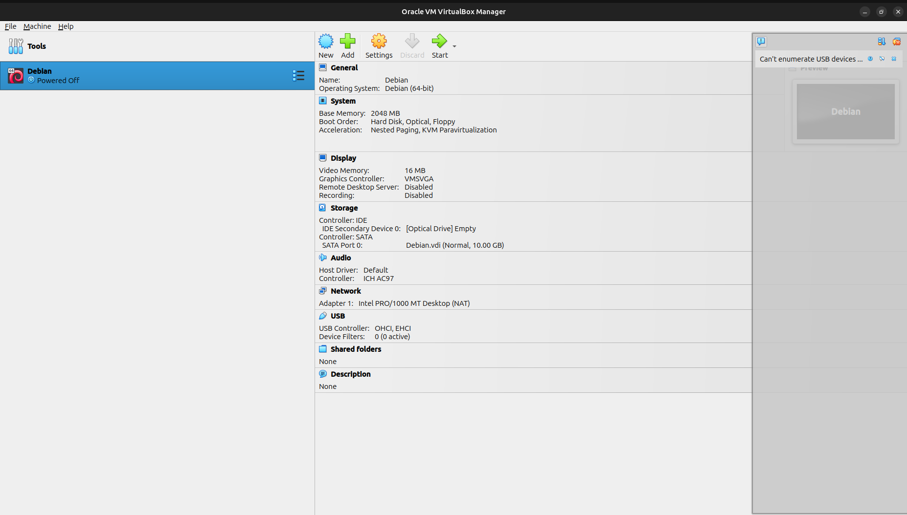
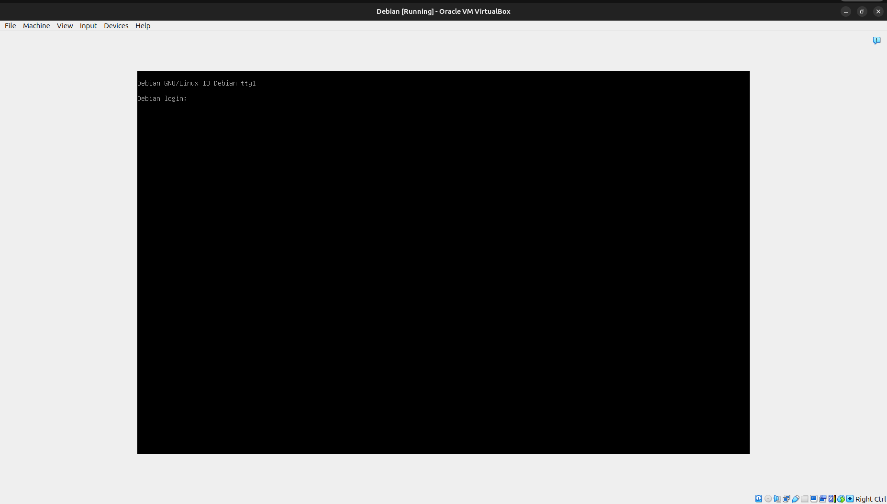
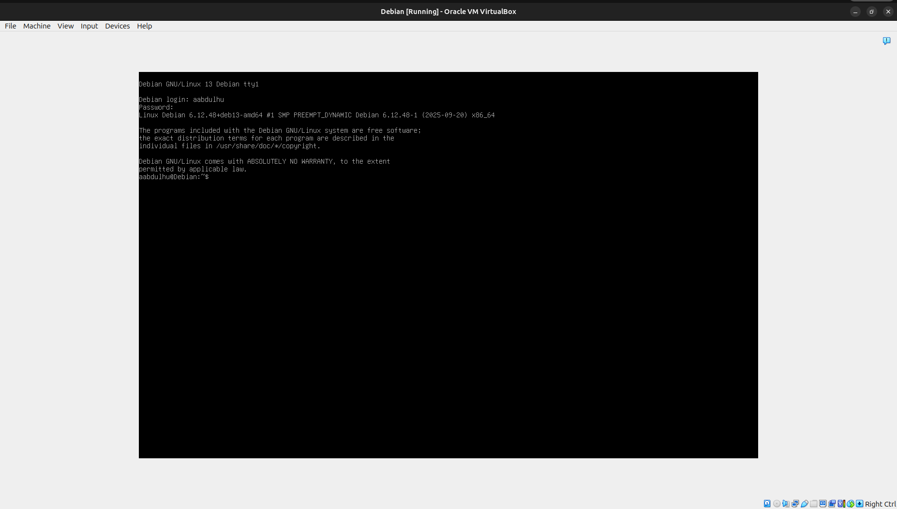
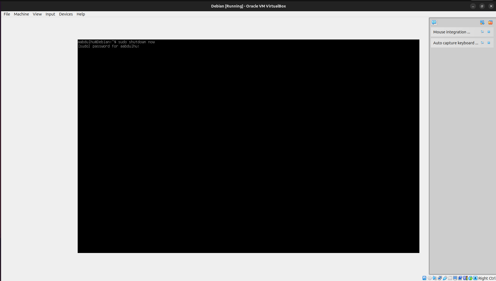

# 🐧 Linux Virtualization Project

[](https://opensource.org/licenses/MIT)
[](https://www.debian.org/)
[](https://www.virtualbox.org/)
[](https://mac.getutm.app/)

## 📌 Project Overview

A comprehensive demonstration of Linux virtualization using Debian distribution. This project showcases the complete process of setting up, installing, and managing a Debian virtual machine, including console operations and command-line administration.

### 🎯 Project Objectives
- Demonstrate Linux kernel and Debian distribution concepts
- Implement virtualization best practices
- Showcase command-line proficiency
- Document VM lifecycle management

### 🛠 Technical Specifications

| Component | Specification |
|-----------|--------------|
| **Host OS** | Cross-platform (Linux, Windows, macOS) |
| **Virtualization** | VirtualBox (x86_64) / UTM (Apple Silicon) |
| **Guest OS** | Debian 12 (Bookworm) |
| **ISO Type** | netinst (Network Installer) |
| **Memory** | 2 GB RAM |
| **Storage** | 10-20 GB Virtual Disk |
| **CPU** | 1 vCPU |
| **Network** | NAT/DHCP |
| **Installation** | Minimal (CLI only, no GUI) |

## 🚀 Quick Start

### Prerequisites

- **System Requirements**: 4+ GB RAM, 25+ GB free disk space
- **Virtualization Support**: Hardware virtualization enabled in BIOS/UEFI
- **Network**: Internet connection for package downloads

### Installation

1. **Install Virtualization Software**
   ```bash
   # Ubuntu/Debian
   sudo apt update && sudo apt install virtualbox -y
   
   # Windows/macOS: Download from virtualbox.org
   # Apple Silicon: Install UTM from mac.getutm.app
   ```

2. **Download Debian ISO**
   ```bash
   wget https://cdimage.debian.org/debian-cd/current/amd64/iso-cd/debian-12.2.0-amd64-netinst.iso
   ```

3. **Create and Configure VM**
   - Name: `Debian`
   - Type: Linux (Debian 64-bit)
   - Memory: 2048 MB
   - Storage: 15 GB (dynamically allocated)

## 📖 Usage Guide

### VM Creation and Setup

1. **VM Configuration**
   ```
   VM Name: Debian
   Operating System: Linux → Debian (64-bit)
   Base Memory: 2048 MB
   Create Virtual Hard Disk: VDI, 15 GB, Dynamically allocated
   ```

2. **Debian Installation Process**
   - Boot from netinst ISO
   - Language/Location: Configure as needed
   - Network: Accept DHCP defaults
   - Partitioning: Guided - use entire disk
   - Software Selection: Standard system utilities only
   - Install GRUB bootloader

3. **Post-Installation Verification**
   ```bash
   # System information
   uname -a
   lsb_release -a
   
   # Network connectivity
   ping -c 3 debian.org
   
   # Package management
   sudo apt update
   ```

### VM Operations

#### Starting the VM
```bash
# VirtualBox CLI (optional)
VBoxManage startvm "Debian" --type headless
```

#### Console Login
```bash
# Login with created user credentials
username: [your-username]
password: [your-password]
```

#### Shutdown Procedures
```bash
# Graceful shutdown
sudo shutdown -h now

# Alternative methods
sudo poweroff
sudo halt
```

## 📁 Project Structure

```
linux-virtualization-project/
├── README.md                 # This documentation
├── system-info.txt          # System specifications
└── screenshots/             # Visual documentation
    ├── vm-list.png          # VM manager showing Debian VM
    ├── debian-login.png     # Login prompt
    ├── debian-shell.png     # Active shell session
    └── debian-shutdown.png  # Shutdown command execution
```

## 📷 Documentation Screenshots

The `screenshots/` directory contains visual proof of successful implementation:

### VM Manager View

*VirtualBox/UTM interface showing the Debian VM*

### Debian Login Screen

*Debian console login screen*

### Active Shell Session

*Successful login with active shell prompt*

### Shutdown Command

*CLI shutdown command execution*

## ✅ Validation Checklist

### Technical Requirements
- [x] Virtualization software installed and functional
- [x] Debian 12 VM created with specified parameters
- [x] VM boots successfully (< 2 minutes)
- [x] Console login authentication works
- [x] CLI shutdown commands execute properly
- [x] Documentation screenshots captured
- [x] System information collected

### Performance Metrics
- [x] Boot time: < 2 minutes
- [x] Memory usage: < 2 GB
- [x] Disk space: Minimal installation
- [x] Network connectivity: Functional

## 🔧 Troubleshooting

### Common Issues

| Issue | Solution |
|-------|----------|
| VM won't boot | Verify virtualization is enabled in BIOS |
| Slow performance | Increase RAM allocation or enable hardware acceleration |
| Network issues | Check host network connectivity and VM network settings |
| Login problems | Verify username/password during installation |

### Debug Commands
```bash
# Check VM status
VBoxManage list runningvms

# View VM configuration
VBoxManage showvminfo "Debian"

# System logs (inside VM)
sudo journalctl -f
```
